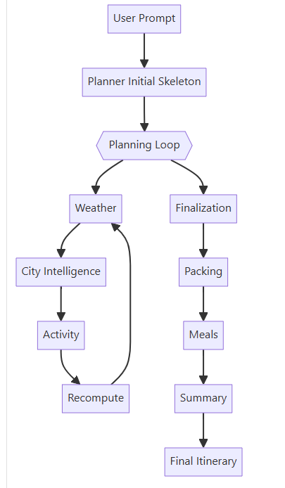

# One-Day-Odyssey

An AI system that engineers the ultimate day trip.

---

## 📘 Project overview

Planning a trip is surprisingly complex. Travelers must research weather, compare cities, choose activities, plan schedules, decide what to pack, and even think about meals—often switching between dozens of tabs. Most tools solve only one fragment: an itinerary generator, or a packing list tool, or a weather lookup. None deliver a fully integrated, context-aware travel plan end-to-end.

This project solves that by creating a multi-agent travel planning system that produces a complete travel blueprint in one flow: itinerary, packing list, meals, and a final summary. Each part is generated with awareness of weather, location intelligence, user preferences, and day-to-day consistency.

---

## 🧭 Architecture Overview

Here's how One Day Odyssey is structured under the hood:

---

## 📺 Demo Video

🎥 [Watch the Demo on YouTube](https://youtu.be/-OAffoMWl3E?si=FW0xNhAYvNl2AXyl)

---

## 🧩 Why Multi-Agent Architecture?

A single model struggles to perform long-range planning, maintain consistency, and update plans based on dynamic information like weather or city characteristics. Multi-agent systems excel at decomposition, specialization, and iterative refinement.

By splitting the workflow into dedicated agents—Planner, Weather, City Intelligence, Activity Planner, Packing, Meals, Summary, and a Recompute unit—the system produces higher-quality results, fewer contradictions, and a more human-like reasoning pipeline.

Agents collaborate through a controlled loop, allowing each one to refine details and feed insights back into the overall plan. This leads to itineraries that are feasible, weather-aware, balanced, and practical.

---

## 🛠️ Tech Stack

* Google Agent Development Kit (ADK)
* Python
* Google Multi-Agent Controller for managing sequential and iterative loops
* Google Gemini LLM models
* Kaggle Notebook for development, evaluation, and visualization
---

## What This Project Achieves

This project demonstrates how multi-agent systems can solve a real-world, multi-step planning problem with depth and coherence that single models struggle to achieve. It highlights the power of decomposition, specialization, and iterative refinement—producing travel plans that feel thoughtful, adaptive, and genuinely useful.

Future extensions could include:

Real-time map embeddings
Accommodation/flight suggestions
Personal preference profiles
Automatic cost estimation
Auto-generated PDFs or travel booklets

In its current form, the system already delivers an end-to-end, user-friendly travel planning assistant powered by intelligent, self-coordinating agents.

---
